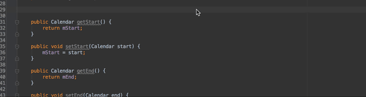

IdeaAscii
=========

IdeaAscii is an IntelliJ plugin to generate comments as ASCII artwork.

Installation
------------

`Preferences > Plugins > Browse repositories... > Search for "IdeaAscii" > Install Plugin`

Usage
-----

Locate your cursor where you would like to add a comment/heading, and press `ctrl shift I`.  Type in the text you would like generated, and hit enter.  Your text will be converted to ASCII and automatically commented.

Alternatively, you can go to `Tools > Insert Ascii Comment`.

Configuration
-------------

You can change the font by going to `Tools > Select Ascii Font`.  The item you select from the dropdown menu will become the font used until you change it.

The default font is 'ivrit' simply because that's what I've used before and like the way it looks.  For some reason, this particular font always seems to be generated in reverse, so I've fixed that interally.  If you notice any other fonts that are rending backward, please let me know.

Developed By
------------

[Jonathon Staff](http://jonathonstaff.com)

License
=======

    Copyright 2014 Jonathon Staff

    Licensed under the Apache License, Version 2.0 (the "License");
    you may not use this file except in compliance with the License.
    You may obtain a copy of the License at

    http://www.apache.org/licenses/LICENSE-2.0

    Unless required by applicable law or agreed to in writing, software
    distributed under the License is distributed on an "AS IS" BASIS,
    WITHOUT WARRANTIES OR CONDITIONS OF ANY KIND, either express or implied.
    See the License for the specific language governing permissions and
    limitations under the License.
